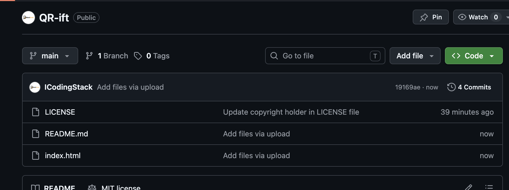

# ✨ QRift

> Artistic QR Codes That Stand Out — Beautiful, customizable, and completely free.

[🚀 Live Demo](https://icodingstack.github.io/QR-ift) • [📦 Download](https://github.com/icodingstack/QR-ift/archive/refs/heads/main.zip) • [🐛 Report Issue](https://github.com/icodingstack/QR-ift/issues)

---

## 🎨 One-Sentence Description

Generate stunningly beautiful, fully customizable QR codes with glassmorphism design, subtle particle effects, and premium styling — all in your browser, **100% free forever**.

---

## ✨ Key Features

- 🎨 **Artistic Customization**: Choose from multiple dot styles, corner styles, gradients, and more
- 🌈 **Premium Design**: Elegant glassmorphism UI with smooth animations and micro-interactions
- 🌓 **Dark/Light Mode**: Beautiful automatic theme switching
- 🖼️ **Logo Integration**: Upload your own logo or use built-in icons
- 📱 **Fully Responsive**: Works perfectly on mobile, tablet, and desktop
- 🔐 **100% Client-Side**: No data leaves your browser — completely private
- 💾 **Local History**: Your recent QR codes saved in the browser
- 🎁 **Surprise Me**: One-click beautiful artistic presets
- 📤 **Multiple Exports**: Download as PNG, SVG, or copy to clipboard

---

## 📸 Screenshots

*Main interface with real-time preview*

---

## 🚀 How to Use

1. Enter your content (URL, text, WiFi, phone, etc.)
2. Customize style, colors, gradients, and add logo
3. Watch the QR code update in real-time
4. Download as PNG or SVG, or copy to clipboard

---

## 🛠️ Tech Stack

- HTML5 + Tailwind CSS (via CDN)
- Vanilla JavaScript
- qr-code-styling library
- 100% client-side (no backend required)

---

## 📄 License

This project is licensed under the [MIT License](LICENSE) — feel free to use, modify, and share.

---

**Made with ❤️ by [BlackBirdo](https://blackbirdo.com)**
